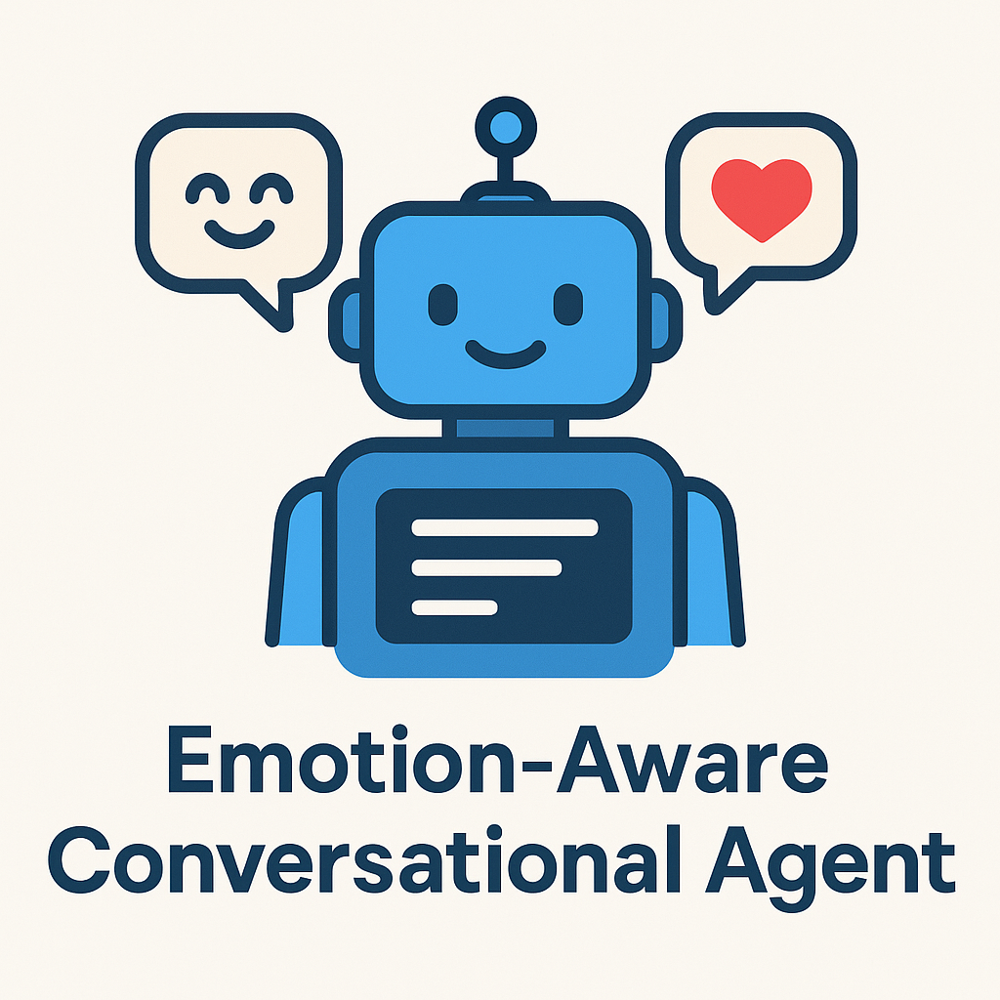

# EACA - Emotion-Aware Chat Conversational Agent

Building a more natural, empathetic, and responsive conversational agent by enabling it to understand user emotions in real time.

Our focus: A text and audio-based ERC system that can be integrated into a chatbot.

This repository and all of the code contained within it are the result of the collective efforts of a group of students enrolled in the Purdue University course CSCI 49500. The project represents our work for the course curriculum and is part of our academic requirements.